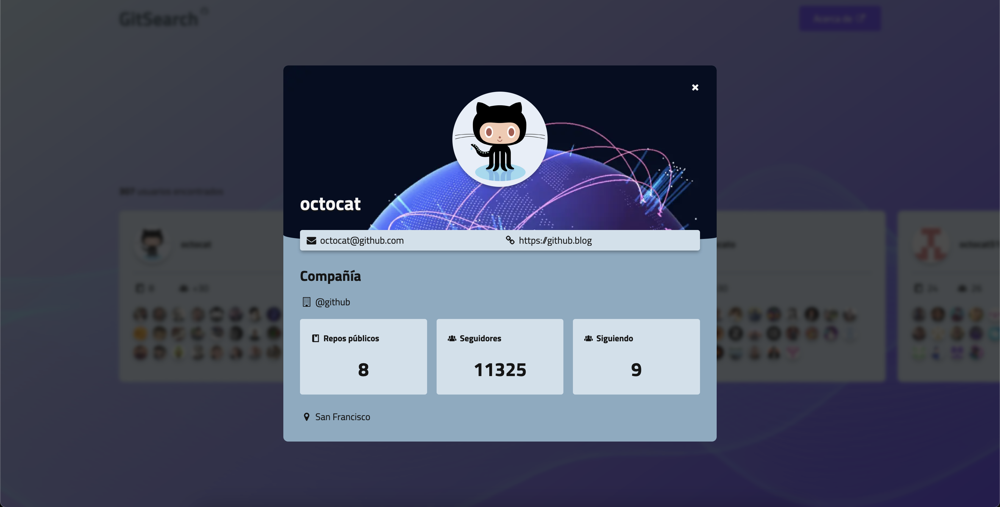
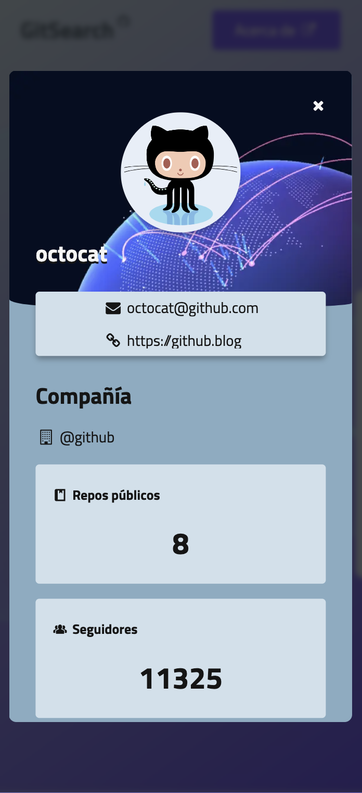

# GitHub API + Vite + Svelte + TS + SASS

[](https://git.io/typing-svg)

Application that retrieves any user from GiHub and shows the most relevant information.


> Live [here](https://get-any-github-user.netlify.app/) 🚀

## Docs 📄
- [Vite](https://vitejs.dev/guide/)
- [Svelte](https://svelte.dev/docs/introduction)

## Install 💾
Clone the repository https://github.com/simonemandola/get-any-github-user-svelte and install dependencies:
```bash
npm install
```
You need .env variable

```
VITE_GITHUB_TOKEN=
```

## Run Development Server 🏃‍♂️
Run the command below:
```bash
npm run dev
```

And open: [http://localhost:5173/](http://localhost:5173/)


## Build 🏗️
Run the command below:
```bash
npm run build
```
Publish directory: **/dist**

## Screenshots

### Desktop




### Mobile
<div style="display: flex; flex-direction: column; align-items: center; row-gap: 1rem">
    
    
    
</div>
